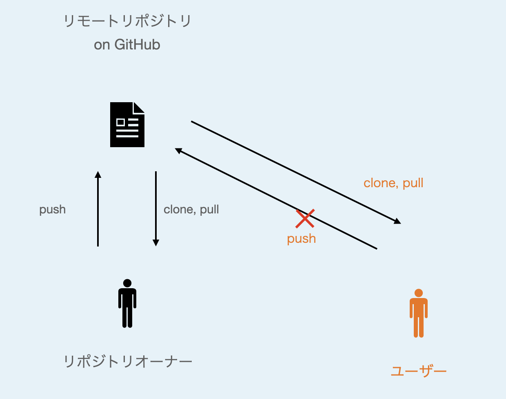
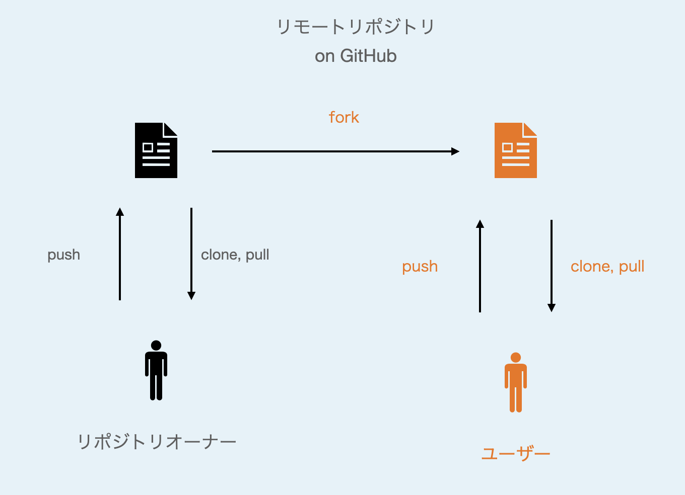
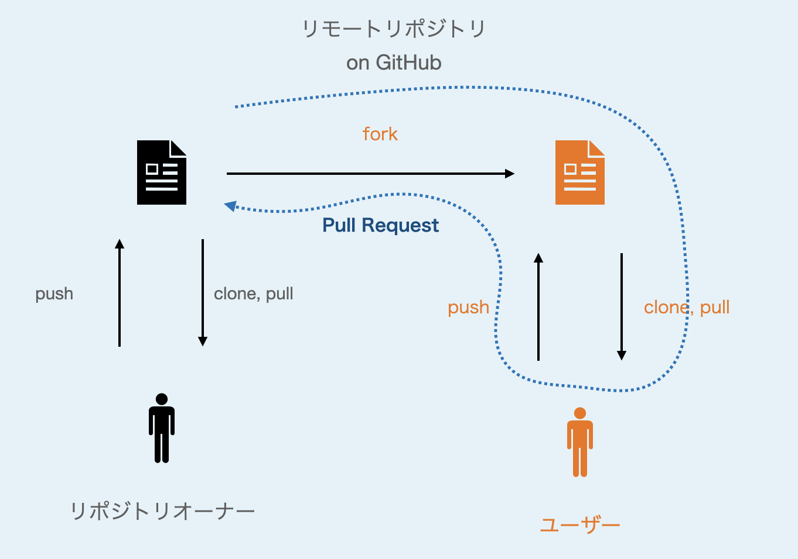

# GitとGitHubの使い方

[松浦知也](https://matsuuratomoya.com)

藝大生向けGitの使い方チュートリアル

2023/09/15 Panasonic D+IOワークショップ

## Gitとは？

Gitとは、テキストやプログラムのソースコードの**バージョンを管理するシステム**(Version-Control-System:VCS)[^others]です。

例えば、プログラムに複数の新しい機能を追加するときに、機能ごとに別々のバージョン（**ブランチ**）を作成して、最終的にすべての機能が開発し終わってからすべての機能を合流（**まーじ**）させることができます。

またGitの特徴として、作業しているディレクトリ（**リポジトリ**）の内容を、サーバー上にあるコピー（**リモートリポジトリ**）と同期しながら作業できる点があります。複数人が一つのリモートリポジトリを介して共同作業するのに適しています。

[^others]: Git以外のVCSの代表例としては、より歴史の長いSubversionや、Gitと同じくリモート管理の機能を持つmercurial(hg)などがあります。

## GitHubとは？

GitHubとは、Gitの機能を活用して、オンライン上で（時に顔も知らない人々と）ソフトウェアやドキュメントをコラボレーションしながら開発するためのWebサービスの一つ[^others2]です。

例えば、ソフトウェアのバグ報告や機能追加のディスカッションや、組織外のユーザーからコード変更の提案をGitの機能を介して受け付ける**プルリクエスト**（マージリクエスト）のような機能があります。

最近は、リポジトリの更新に応じてソフトウェアを自動でパッケージ化したり、ドキュメントの内容をWebサイトとして公開できるような機能もあります。

[^others2]: 類似のサービスとしてBitBucketやGitLabがあります。GitLabは自前のサーバー上でホストすることもできるオープンソースソフトウェアで、セルフホストが前提の類似ソフトとしてはGiteaなどがあります。

> [!NOTE]
> Gitそのものの機能とGitHubの機能の区別がはじめはよくわからないと思いますが、Git自体はオフライン環境で一人で使う分にも非常に有用ですので、活用してみてください。

## 1. GitHub Desktopをインストールしよう

ブラウザで以下のURLにアクセスして、GitHubのデスクトップクライアントアプリケーションをインストールしましょう。

https://desktop.github.com/

Macの場合はダウンロードしたZipを開くと、`.app`のファイルが出てくるので、アプリケーションフォルダにコピーします。

初回起動時にGitHubのアカウントを作るよう指示されるので、アカウント作成がまだの人は作成してください。

> [!NOTE]
> GitもGitHubも、この専用のアプリを使わなくても操作は可能です。macOSには標準でコマンドラインから`git`コマンドが使えます。Visual Studio Codeのように汎用エディタにGitクライアントが統合されているものもあります。他のGUIクライアントとしてはGitKrakenなどがあります。

## 2. リポジトリをクローンしてみよう

Webブラウザでこの親リポジトリにアクセスしましょう。

https://github.com/geidai-amc-lab/git-tutorial

右上のCodeという緑色のメニューの中にある、"Open with GitHub Desktop"をクリックすると、GitHub Desktopのアプリが立ち上がります。

指示に従うと、このリポジトリの内容がそのまま`~/Documents/GitHub/git-tutorial`にコピーされてきます。この、リモートからローカルへリポジトリの内容をコピーする作業を**クローン**といいます。

クローンしたリポジトリには他の人の作業履歴などが圧縮された形で`.git`という隠しディレクトリに保存されています。

## 3. ファイルを追加してみよう

例えばここから自分の編集したファイルを何か追加してみるとしましょう。

`my-favorite-sushi`というディレクトリがあるので、新しく`{自分の名前}.txt`というテキストファイルを作成します。(macならテキストエディット.appを使ってもいいですね)

テキストファイルの中にはあなたの好きな寿司🍣ネタを書いて保存してください。

この状態ではまだあなたの追加したファイルはGitリポジトリの歴史に書き込まれていません。

ここで改めてGitHub Desktopを開くと、左側のメニューに追加したファイルとその変更内容がプレビューできるようになっています。

左下に、今回何を変更したかについての概要を書く欄があるので適当に記入してください。（__*メッセージなしで履歴に書き込むことはできません。__*）

最後に、左下の"Commit to main"というボタンを押すと、あなたのコンピューター上に新しく履歴が追加（コミット）されます。

(Warningが出ていると思いますが、一旦無視してコミットしてみましょう。)

> [!NOTE]
> GUIのアプリでは、変更履歴に書き込む対象のファイルを選択するステージング(コマンドだと`git add`)と、ステージに上がったファイルをメッセージをつけて履歴に書き込む**コミット**（コマンドだと`git commit -m "メッセージ"`）という2つの作業が同時に行われています。
> 一度のコミットに対して複数のファイルの変更を紐づけることもできますし、逆に1ファイルの変更のある一部分だけをステージに上げることも可能です。

## 4. 変更をリモートに同期しよう

ローカルの変更した履歴をリモートに上げるためには`Push`という作業を行います。

コミット後に出てくるPush to Originというボタンをクリックしてみましょう。

そうすると、"Do you want to fork this repository?"という警告が表示されます。

これは、あなたがリポジトリのオーナーやチームのメンバーじゃないけど書き込みをしようとしているからです。（逆に、自分の管理しているリポジトリが知らない人の変更を勝手に受け付けて中身が書き変わってしまったら大変です。）

そこでまず、Create Forkを選択してGitHub上にあなたの管理する、このリポジトリのコピー（フォーク）を作成しましょう。

そうすると、メニューで`Repository→Repository Settings`を押すと、`Primary Remote Repository`というところのURLが、フォーク後は`https://github.com/{あなたのGithubユーザーID}/git-tutorial.git`になっているはずです。

フォークの作業が終わったら、改めてPush to Originを選択して、フォークしたGitHub上のリモートリポジトリ（管理者は自分なので問題なし！）に同期させます。

> [!NOTE]
> 単にリポジトリをクローンした場合は、リモートリポジトリには`origin`という名前がついています。
> リポジトリをフォークしてクローンした場合は、自分の管理するリモートリポジトリが`origin`、フォーク元のオリジナルのリポジトリのことを`upstream`と名付けてやり取りすることが多いです。

## 5. Pull Requestを送ってみよう

先ほどのPushが終わったら、自分のリポジトリのURLにブラウザでアクセスしてみましょう。

https://github.com/{あなたのGithubユーザーID}/git-tutorial

おそらく、フォーク元のリポジトリへPull Requestを送ることをサジェストされると思います。

プルリクエストは、複数のコミット履歴と共にメッセージを送ることで、フォーク先での変更を元リポジトリに取り込んでください、というお願いをすることができます。

リクエストを、元リポジトリのオーナーが承認することで元リポジトリのコードに変更履歴が*マージ*されます。

## 6. （オプション） Pull：リモートで更新された履歴を取り込む

TBD...

# 用語集

- リポジトリ
- ブランチ
- リモートリポジトリ
- コミット
- マージ（Merge）
- フェッチ（Fetch）
- プル（Pull）
- ヘッド（Head）
- スタッシュ（Stash）
- フォーク（Fork）
- オリジン（origin）
- アップストリーム(upstream)
- プルリクエスト

# 補題：Markdownの使い方

https://docs.github.com/ja/get-started/writing-on-github/getting-started-with-writing-and-formatting-on-github/basic-writing-and-formatting-syntax 

